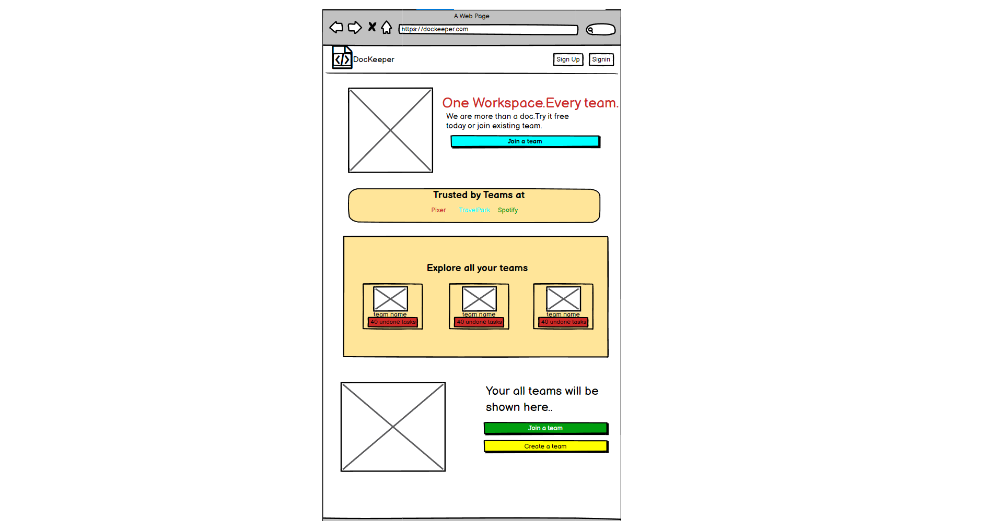
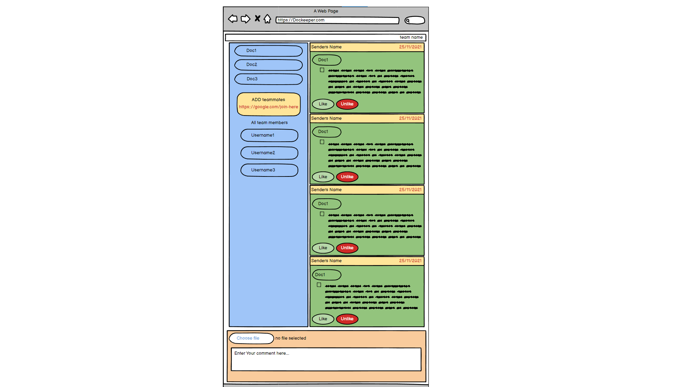
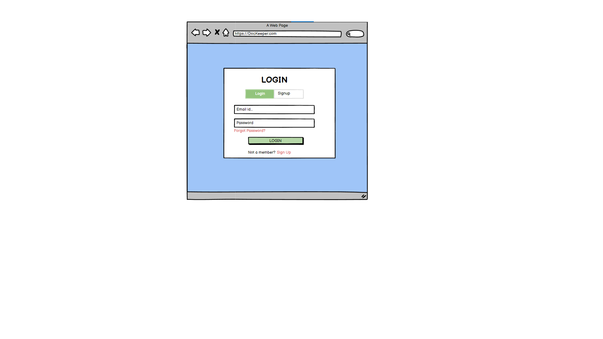

# Dockeeper project

*This project is currently in beta and hosted at: http://walkover-deploy-dockeep.herokuapp.com/ . See the [version 1 roadmap here](https://github.com/apurbamaity/DocKeeper)*

This app allows users to work as a team and store documents in their workspaces.They can then keep track of their progress,upload files and download files.

## Table of Contents

1. [Running Locally](#running-locally)
1. [Tech Stack](#tech-stack)
1. [Mockups](#mockups)
1. [Design](#design)
1. [Routes](#routes)
1. [MVP Features](#mvp-features)
1. [Version 1 Features](#version-1-features)

## Running Locally

1. Clone this repo
1. `cd FRONTEND`
1. `npm i`
1. `npm start`

## Tech Stack

1. HTML
2. CSS
3. React JS
4. spring boot for api
5. DB----MySQL
6. AWS/Heroku (hosting)

## Mockups

  

  

  

## Design

Color Palette:

710627 - EA5455 - FAA275 - F5E4C3 - 34A7B2

## Routes

* / --> Home Page/Landing Page
* /joincreate --> join or create a workspace
* /signin | /signup --> signin or signup
* /teaminside --> send docs in a workspace

## MVP Features

1. Home Page to explore all the workspaces
2. Form Page to Sign in or Sign Up
3. User can create a new workspace/join an existing workspace
4. User can upload files and read/download files inside the workspace.
5. User can also invite other players to join workspaces. 

## Version 1 Features

1. Users can log in and join/create workspaces
2. Users can upload/download/read documents inside their workpaces
3. Users can invite other users to their workspaces by invite code.
